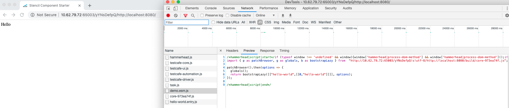
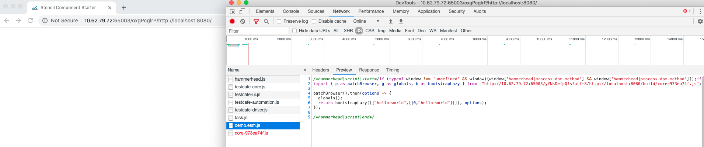
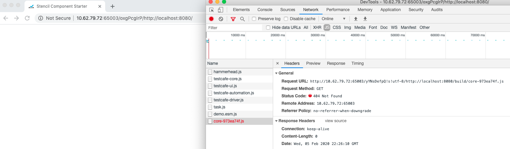

## Demo repo to replicate the testcafe-hammerhead cache-control bug (using stencil & testcafe)

**Steps to reproduce the issue**

1. Clone this repo and install the dependencies ==> `npm i`
2. Run `yarn test` and check the failing test
* > Run `yarn testdebug` to debug the network requests in chrome dev tools
3. Run `yarn testcache` and check the same test pass
* > Run `yarn testcachedebug` to debug the network requests in chrome dev tools

*****

### **RCA**

* If a javascript file is imported inside another js file (like how the latest stencil generates components), testcafe-hammerhead rewrites by replacing the relative URL path for the imported file(s) with the absolute URL

* sample: `http://10.62.79.72:63504/cfm8YXvv2!s!utf-8/`http://localhost:8080/build/core-973ea74f.js

* The rewritten js file `demo.esm.js` (in this e.g,) is cached internally in a jsCache variable - (https://github.com/DevExpress/testcafe-hammerhead/blob/master/src/processing/resources/script.ts#L13)

* When the second test is executed and when the application/browser requests `demo.esm.js` file, it returns the old file which has the rewritten import that has the url with the old session id.

The only time this works is when the server sets the cache-control header properly and browser caches the asset (previously requested js file through import)

### **Screenshots**

**Test1 (session id: yYNSDefpQ)**: 

**Test2 (session id: oxgPcglrP)**: returns cached `demo.esm.js` which has hard-coded baseURL pointing to previous session ID for the imported js file

Test2 (cached url): 
Cache control header: 
